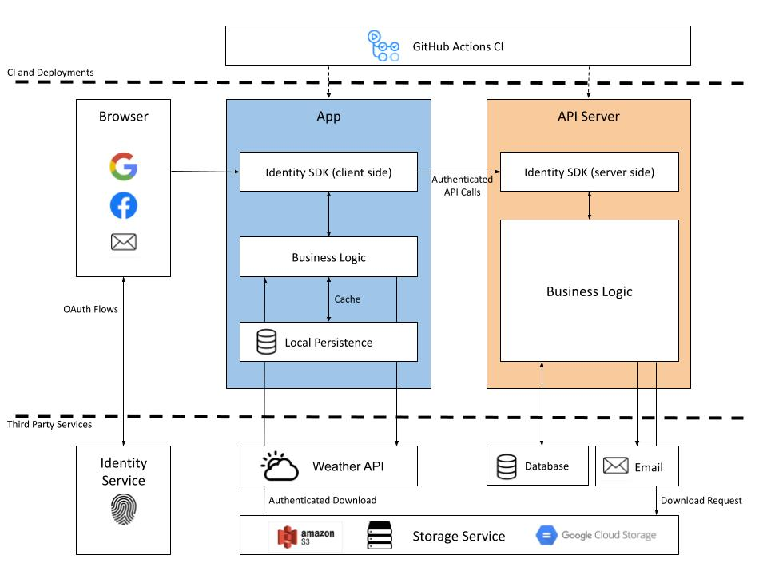

# MY CAMSPITE

> _Note:_ We collaborated on this assignment using Google Docs so that we could see live edits as we worked together.

## Product Details

#### Q1: What are you planning to build?

My Campsite is a mobile application that allows campers to geocache their memories in the form of short video clips or messages. Many campsite users develop a form of attachment to their campsite and will often come back to their same getaway location time and time again, but unlike a hotel, there is no guestbook. My Campsite allows campers to view and sign a “digital guestbook” tied to their location to make their camping experience an unforgettable one. The app serves as a tool to connect campers by allowing them to share images or videos of the family on vacation, a neat camp setup, or nature in its varying seasons, and view similar entries stretching back days, months, or even years.

Furthermore, park naturalists can use this app to share and highlight educational clips on issues of climate change or observations about animals or plant species in the area. The map feature will guide users to nearby locations of interest marked by the naturalist. This will encourage users to seek out new experiences, as they must visit the location to view the clips, like finding a hidden treasure. Users of the application will be expected to have access to an internet connection to create, upload, and view postings based on their geolocation.

Please see our mockup on [Figma!](https://www.figma.com/file/U6gluqQYh39eoiBUptQVpn/My-Campsite-draft-v1?node-id=0%3A1)

#### Q2: Who are your target users?

Our target users are campers, which encompasses a wide range of people. Some users we anticipate will be interested in our app are first-time campsite users who wish to discover points of interests and share their new experiences, first-time or returning campsite users who wish to sign a virtual guest book to create or continue a tradition, and seasoned users or park naturalists who wish to share stories and tips with other users. In addition, some users are given admin roles to monitor user content and manage camping site options provided by the app.

Please see our user personas [here!](https://docs.google.com/document/d/1-ykGck_XBqfqPm2JWTnghnxHFujxPR4u96-p6_Xbw_c/edit?usp=sharing)

#### Q3: Why would your users choose your product? What are they using today to solve their problem/need?

Our product solves a problem that most people have never thought of: how to leave digital messages for future campsite users and view messages from users in the past. On a higher level, what this does is promote a positive culture around camping and a feeling of connectedness to other campers. This allows users to discover new information, as it automatically serves location-specific content that allows users to easily discover points of interest, camping tips, and social media posts without having to sift through the wider internet.

Our guest book feature connects campsite users to each other to foster community, unlike on generic social media platforms where user content is either from friends and family or served by a more general algorithm. Our app’s content is tied to physical location, which encourages prospective campsite-goers to discover the campsite’s content by themselves, rather than sitting at home and scrolling through photos from bed. All of these features align with Ontario Parks’ values, as they promote camping culture, community, and exploring nature.

#### Q4: How will you build it?

The technology stack we will be using includes React Native and Expo for the front end, and Express.js for the backend services. We will use Heroku for backend deployment. For CI/CD and testing, we will use GitHub Actions, Jest, and Docker. The strategy for testing is to develop and run tests locally, and ensure that they pass before merging pull requests to the main branch.

We will be using a wide variety of third party applications to serve our business logic for the application, relying mainly on open source APIs and proprietary services such as Google Cloud Platform for displaying map, weather, uploaded video or image content.

The first layer of our application will consist of the login and email validated account creation features, with an identity service that manages authentication for the user through Google’s Identity Platform.

Past this layer, users and administrators will have access to our main application UI which features a map view using Google Maps Javascript API, and access to backend endpoints that provide current weather information from the Government of Canada Weather API (https://api.weather.gc.ca/), geolocation data of campsite locations, access to uploaded content, and profile information for the current user.

We have provided a detailed drawing of our application’s architecture below for your visualization.

#### Q5: What are the user stories that make up the MVP?

## Please find our user stories [here!](https://docs.google.com/document/d/1GasjU5uEUGwRc0ZMOF_8cDe7pJPmr9xvX3mj73OEgfM/edit)

## Intellectual Property Confidentiality Agreement

As per the discussions with our partner, this project will be made available to the public and released under an open source license. Specifically, the source code and art assets will be released under Apache License 2.0. However, while the app is under development during the course, all deployed systems and artifacts will only be accessible to us and our partner.

## Process Details

#### Q6: What are the roles & responsibilities on the team?

_Roles:_

Scrum Master

- Leads the weekly scrum meeting in which we go over the work items during the current project iterations.
- Lets the team know when a member is facing roadblocks in current issues and tries to connect them with an appropriate teammate to get it resolved.

Project Manager

- Leads high-level discussion on project requirements to ensure that development is progressing in a way that reflects the needs of the partner.
- Distributes tasks between team members to ensure that everyone is able to have equal opportunity to contribute.

DevOps

- Develops and maintains CI/CD pipelines.
- Provisions, monitors, and maintains resources required to operate the software.
- Assists in setting up development and testing environments.

Designer

- Ensures that UI components are up to standard to the layout of the application mockup.
- Creates art assets and mockups.

QA

- Conducts end-to-end testing of the software to discover bugs, and verify that the features align with accepting criterias.

Developer

- Writes software according to partner specifications and Project Manager recommendations, following specifications of the CI/CD pipeline created by the DevOps member(s).

_Members:_

Kirby Chin

- Roles: Developer, DevOps
- Strengths: MERN stack, Angular, Graphics APIs
- Weaknesses: TDD, Vue, Documentation
- Focus: Full stack, map functionalities and computer graphics, administrator API services, administrator API integrations, allow admin to interact with map locations

Feiyang Fan

- Roles: Developzer, DevOps, QA
- Strengths: React, Express, postgreSQL, MongoDB
- Weaknesses: Cloud, Design, Management
- Focus: Frontend, storage(database), weather feature, guestbook posting/viewing

Danyal Khan

- Roles: Developer, QA, DevOps
- Strengths: React, Express, AWS
- Weaknesses: CSS, SQL, Testing
- Focus: Full Stack, App Deployment, backend authentication/permissions for users and admin

Chaoyu Liu

- Roles: Developer, DevOps, Scrum Master, Designer
- Strengths: React, Express.js, postgreSQL
- Weaknesses: Cloud providers, DevOps, CSS
- Focus: full stack, map functionalities, authentication, API services, API integrations, Identity, viewing/posting orchestration, confirm location of user
- Non-software work: lead weekly scrum master meetings, connect teammates working on different features, assign tasks

Janine Newton

- Roles: Project Manager, Developer, Designer
- Strengths: React, Express, MongoDB
- Weaknesses: SQL, DevOps, Testing
- Focus: overall front end design/flow, UX/UI, view guestbooks feature, front end admin dashboard
- Non-software work: set up and lead meetings, communicate with partner, ensure project direction meets partner’s specifications, assign tasks

#### Q7: What operational events will you have as a team?

We will conduct weekly scrum meetings online to ensure everyone is up-to-date on the development progresses of others, and discuss various development issues. We will organize code reviews on GitHub as major changes or additions are being developed, so that team members are aware of breaking changes or new libraries being made available. We will also use Discord for general communication and ad hoc meetings, separating important messages into the “reminders” channel and important links into the “links” channel.

During our meetings with our partner, we discussed the requirements of the software, including user stories and clarifications on feature specifications. We also discussed the background of the project and the software licensing options. We determined that the partner is looking for a simple app that can be used as a prototype to show to organizations such as Parks Ontario or Parks Canada to determine if they are interested in funding the project. We also determined that the main idea of the app is its location specific content, which is very important to the partner. We shared our mockup with the partner, which he was generally happy with. Finally, we determined that the partner would like to leave most technical decisions up to us.

Please see our meeting minutes [here.](https://docs.google.com/document/d/1rmmDhaoSD4sdpDHnvYgeUlyBw_H6bZejKAEMaxDh5Uc/edit?usp=sharing)

Currently, we meet bi-weekly with our partner. However, ad-hoc meetings may occur if important topics arise during development.

#### Q8: What artifacts will you use to self-organize?

We will use GitHub Projects and create GitHub Issues to organize our work tasks. GitHub’s labelling feature allows us to prioritize issues based on urgency such as “high”, “medium”, and “low”. Tasks will be assigned to team members by the Project Manager and Scrum Master. Our project page will have sections “To Do”, “In Progress”, “Done” in which issues can be organized and moved along as tasks are completed.

#### Q9: What are the rules regarding how your team works?

_Communications:_

For general communication, we use a Discord server, where important reminders are sent in the “reminders” channel. We expect team members to respond to important questions and discussions within the same day. Team members may also organize voice calls for collaborative programming.

To communicate with the partner, we set the next meeting date with our partner after every meeting (usually within two weeks). These meetings are run by the project manager, who will send a message to the Discord server describing what we will try to discuss in the meeting and add any points that the rest of the team would like to discuss. The project manager is the point of contact with the partner and may also email our partner or schedule meetings if important questions arise during development.

_Meetings:_

Meeting times will be scheduled based on member availability, using an online time availability poll such as https://www.when2meet.com/. All group members are responsible for informing the team if they cannot attend the lecture, tutorial, or any scheduled meeting through our Discord chat. Members do not need to attend every meeting, and we will schedule meetings so that one person is not routinely left out. If there is a persistent issue, the project manager will discuss it with the team member.

_Conflict Resolution:_

Scenario: the team is divided on which backend technology to use for the partner project. If this occurred, our solution would be to select the most popular choice by participating in a ranked voting process.

Scenario: a team member is behind on their assigned task, but fails to communicate their situation and plans. If this occurred, our solution would be to have the project manager speak to the team member in private to determine what is going on, and if needed, organize a team wide meeting to discuss dividing the task into parts, and reassign responsibilities.

Scenario: a team member often makes major changes to the code base without informing anyone. If this occurred, our solution would be to post a team-wide memo or hold a meeting to discuss proper collaboration protocols, and if it continues, have the project manager speak to the team member privately and enforce code reviews on GitHub pull requests if necessary.

---

## Highlights

The largest insight about the general process is that the technical side of the project will be up to us. For this reason, we’ve decided to use technologies that we are already familiar with and assign roles that we are mostly already comfortable with in order to make the project run more smoothly. We will use our partner meetings to discuss the intended purpose of features, rather than their technical implementations. The project manager will ensure that the partner’s wishes are understood and implemented, while the scrum master will be in charge of more technical discussions and planning within the team. This ensures both our and the partner’s time is used efficiently.

The largest key insight about the app itself is that location-specific content is the core feature. Through our meetings with the partner, it became clear that users must visit a real physical location - this gives them a feeling of connection to the land and encourages them to explore nature to see more. This led to a few decisions - users cannot view or post content from home and will require an internet connection with location services enabled in order to use the app. We considered allowing access without being at the physical location, because users may have no internet connection or may be reluctant to use too much of their personal data. However, we decided this would undermine the partner’s vision for the project.

Another insight was that the purpose of the app is to get people excited about and interested in activities around parks in Ontario. For this reason, we decided that we would like to add a feature that allows interesting posts to be highlighted. These would generally be posts from park naturalists that provide information about specific points of interest. Highlighted posts would be viewable from a greater distance in order to attract campers to check out the location in the post. Similarly, we decided that users should not need an account to view posts, but should need to create an account to submit their own posts. This will allow new users to participate even if they are not comfortable signing up, while allowing existing users to have control over their own content in case they decide to delete it later on.

The final insight is that this app should not be limited to just Ontario Parks - it should be possible to extend it to any region in the future, and not necessarily official campgrounds only. For this reason, we decided to allow users to submit their own new locations. The alternative was to require administrator privileges in order to add a location. Allowing users to submit locations does have potential for abuse, but in discussion with the partner we determined it is better that users can submit various points of interest that may not necessarily be on an official park campsite. Instead, administrators can remove inappropriate locations, edit inaccurate ones, and ban users who have abused the system.
